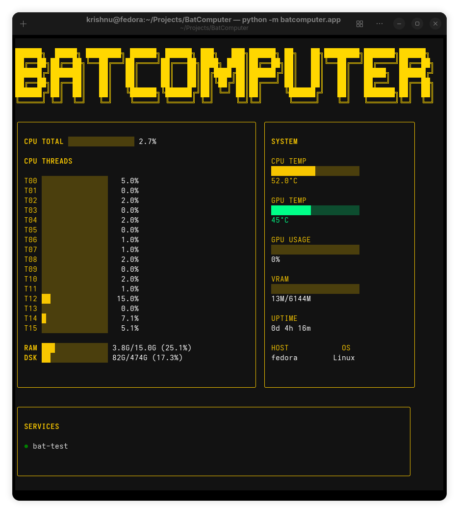

# BatComputer

BatComputer is a terminal-based system dashboard inspired by the many incarnations of Batman's computers throughout comics, television, films, animation, and games.

Unlike traditional monitoring tools, BatComputer aims to combine real-time system monitoring with themed interfaces that capture the visual identity of different eras of Batman.

## Screenshot



## Current Features

* Real-time CPU monitoring
* Per-thread CPU usage
* RAM monitoring
* Disk usage monitoring
* CPU temperature monitoring
* NVIDIA GPU temperature monitoring
* GPU utilization monitoring
* VRAM usage monitoring
* Docker container detection
* Terminal UI powered by Textual

## Vision

Every BatComputer theme represents a different version of Batman's world while displaying the same underlying system information.

Planned themes include:

### Adam West (1966)

Bright colors, bold labels, classic Batcomputer aesthetics.

### Batman: The Animated Series

Art Deco-inspired interface with elegant layouts and gold accents.

### Batman Beyond

Futuristic cyberpunk design featuring neon reds and minimalist displays.

### Arkham Series

Military-style tactical HUD inspired by WayneTech systems.

### Knightmare Batman

Post-apocalyptic survival-themed dashboard inspired by the Knightmare timeline.

### The Batman Who Laughs

Corrupted and chaotic interface featuring glitch-inspired visual effects.

## Roadmap

### v0.1

* CPU monitoring
* RAM monitoring
* Disk monitoring
* GPU monitoring
* Docker service detection

### v0.2

* Docker container controls
* Service health indicators
* Improved service panel

### v0.3

* Theme engine
* Theme switching support

### v0.4+

* Network monitoring
* Remote server monitoring
* Logs viewer
* Multiple Batcomputer themes
* Custom themes

## Installation

```bash
git clone https://github.com/YOUR_USERNAME/BatComputer.git
cd BatComputer

python -m venv .venv
source .venv/bin/activate

pip install -r requirements.txt

python -m batcomputer.app
```

## Philosophy

BatComputer is not trying to replace tools like htop, btop, or lazydocker.

The goal is to create a system dashboard that feels like sitting in front of a Batcomputer while still providing useful information for Linux desktops, homelabs, and servers.

## Built With

* Python
* Textual
* psutil
* Docker CLI
